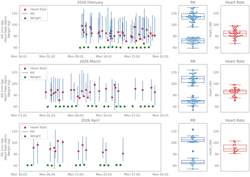

# 📘 rr2graph — RR‑ und Gewichtsdaten visualisieren

`rr2graph` ist ein leichtgewichtiges CLI‑Tool zur Verarbeitung und Visualisierung von Blutdruck‑, Puls‑ und Gewichtsdaten aus Excel‑Dateien.  
Es erzeugt monatliche Diagramme (Box‑Swarm, Scatter, Histogramm, Violin) und speichert sie automatisch als PNG, PDF und SVG.


## 📤 Ausgabe

Exemplarisch hier die Darstellung mit Scatterplot und Box-Schwarnplots:



im Format: A4 Landscape (11.69 × 8.27 inch)

Das Skript listet die erzeugten Dateien im Terminal aus:

```bash
❯ pipenv run rr2graph
Heart rows read: 81
Weight rows read: 49

→ Excel-Datei: rr_data.xlsx
→ Monate: 3
→ Output-Ordner: plots/

Generating histogram plots…
Generated histogram plots stored at:
-- plots/png/(2026-02__2026-04 3 months) per month data and histogram.png
-- plots/pdf/(2026-02__2026-04 3 months) per month data and histogram.pdf
-- plots/svg/(2026-02__2026-04 3 months) per month data and histogram.svg

Generating violin plots…
Generated violin plots stored at:
-- plots/png/(2026-02__2026-04 3 months) per month data and violin.png
-- plots/pdf/(2026-02__2026-04 3 months) per month data and violin.pdf
-- plots/svg/(2026-02__2026-04 3 months) per month data and violin.svg

Generating box_swarm plots…
Generated box_swarm plots stored at:
-- plots/png/(2026-02__2026-04 3 months) per month data and box_swarm.png
-- plots/pdf/(2026-02__2026-04 3 months) per month data and box_swarm.pdf
-- plots/svg/(2026-02__2026-04 3 months) per month data and box_swarm.svg
```

**Help**

```bash
❯ pipenv run rr2graph --help 
usage: rr2graph [-h] [-e EXCEL] [-n NUM_OF_MONTHS] [-o OUTPUT] [-c CONFIG] [-v] [-g] [-i]

Liest Excel-Daten ein und erzeugt daraus Graphiken.

options:
  -h, --help            show this help message and exit
  -e, --excel EXCEL     Pfad zur Excel-Datei (Default: rr_data.xlsx)
  -n, --num_of_months NUM_OF_MONTHS
                        Anzahl der Monate 1–6 (Default: 3)
  -o, --output OUTPUT   Output-Ordner für die erzeugten Plots (Default: plots/)
  -c, --config CONFIG   Pfad zu einer optionalen YAML-Konfigurationsdatei
  -v, --version         show program's version number and exit
  -g, --generate-test-data
                        Erzeugt test_rr_data.xlsx und beendet das Programm
  -i, --info            Zeigt System- und Konfigurationsinformationen an
```

**Info**

```bash
 ❯ rr2graph --info                                                             
rr2graph info
──────────────────────────────────────────────
Version:        0.1.0
Python:         3.14.4
Installiert in: /Users/your_user/your/project/directory/rr2graph

Arbeitsverz.:   /Users/your_user/your/project/directory
System:         Darwin 25.3.0 (arm64)
Terminal:       utf-8

Gefundene Config-Datei: config.yaml
  Excel-Datei:   rr_data.xlsx
  Monate:        3
  Output-Ordner: plots/
──────────────────────────────────────────────
Alles sieht gut aus ✓
```

---

## 🚀 Installation

### 1. Projektverzeichnis vorbereiten

Stelle sicher, dass du im Projekt‑Root bist:

```code
~/your/project/directory/
```

### 2. Pipenv‑Environment installieren

```bash
pipenv install -e .
```

Das installiert:

- dein Paket `rr2graph` im Editable‑Modus  
- alle Dependencies aus `pyproject.toml`

### 3. Optional: Dev‑Dependencies

```bash
pipenv install -r requirements_dev.txt
```

---

## 🧰 CLI‑Usage

Nach der Installation steht dir der Konsolenbefehl **`rr2graph`** zur Verfügung.

### Konfigurationsdatei verwenden

```bash
rr2graph -c config.yaml
```

oder:

```bash
rr2graph –config config.yaml
```

### Testdaten erzeugen

```bash
rr2graph -g
```

oder:

```bash
rr2graph –generate-test-data
```

Erzeugt: `test_rr_data.xlsx`

### System‑ und Projektinfo anzeigen

```bash
rr2graph –info
```

Zeigt:

- Version  
- Python‑Version  
- Installationspfad  
- Config‑Status  
- Excel‑Pfad  
- Output‑Ordner  
- Systeminfo  

---

## 📝 Konfigurationsdatei (YAML)

Beispiel `config.yaml`:

```yaml
excel: "rr_data.xlsx"
num_of_months: 3
output: "plots/"
```

| Feld | Bedeutung |
| ---- | --------- |
| excel | Pfad und name der Excel‑Datei mit RR‑Daten |
| num_of_months | Anzahl der Monate, die ausgewertet werden sollen |
| output | Zielordner für PNG/PDF/SVG‑Plots |

---

## 📊 Output‑Struktur

Nach dem Ausführen von:

```bash
rr2graph -c config.yaml
```

wird automatisch erzeugt:

```code
plots/
├── png/
├── pdf/
└── svg/
```

Bei Testdaten:

```code
plots/test/
├── png/
├── pdf/
└── svg/
```

---
## 📁 Projektstruktur

```code
/your/project/directory/
.
├── config.yaml
├── example_box_swarm.png
├── Pipfile
├── plots/
│   ├── pdf/
│   ├── png/
│   ├── svg/
│   └── test/
├── pyproject.toml
├── README.md
├── requirements.txt
├── requirements_dev.txt
├── rr_data.xlsx
├── rr2graph/
│   ├── cli.py
│   ├── helpers.py
│   ├── io.py
│   ├── layout.py
│   ├── monthly.py
│   ├── orchestrator.py
│   └── plots/
│       ├── box_swarm.py
│       ├── hist.py
│       ├── scatter.py
│       └── violin.py
├── test_config.yaml
├── test_rr_data.xlsx
└── tests/
    └── test_rr2graph.py
```

---
## 🧪 Testdatenerzeugung

```bash
rr2graph -g
```

Erzeugt eine Datei: `test_rr_data.xlsx` mit realistischen RR‑, Puls‑ und Gewichtsdaten.

---
## 🧪 Tests ausführen

```bash
pipenv run pytest
```

---

## 🛠 Troubleshooting

### Fehler: UnicodeDecodeError in YAML

Du hast wahrscheinlich eine Excel‑Datei als --config übergeben.

Richtig:

```bash
r2graph -c config.yaml
```

Falsch:

```bash
rr2graph -c test_rr_data.xlsx
```

- Keine Plots erzeugt
- Excel‑Datei existiert nicht
- Output‑Ordner nicht beschreibbar
- Config‑Pfad falsch

### CLI‑Befehl nicht gefunden

Installiere erneut:

```bash
pipenv install -e .
```

---
📄 Lizenz
(TODO: Optional – kann ergänzt werden.)

---

TODO:

- eine Developer‑Section ergänzen  
- oder die README automatisch aus deinen Modulen generieren lassen  

